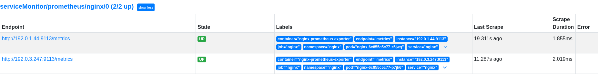
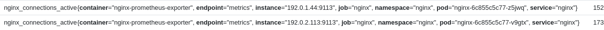

# Scaling applications with HorizontalPodAutoscaling and custom metrics

## Goal
Being able to scale an application based on specific non cpu/memory metrics provided by the application.

## Requirements
- A running k8s cluster (duh).
- Prometheus operator running in the same cluster.
- Prometheus-adapter deployed. See addendum for deployment steps.
- Contour Ingress Controller (if you want to use the HTTPProxy in the example, otherwise swap it out for a normal ingress on a controller of your choice.)
- An application that exposes application-specific metrics. In our example we will use a simple NGINX deployment with nginx-prometheus-exporter but any application that exposes prometheus compatible metrics will do.

## Procedure

### Demo application: Nginx
First, we will need to use an application that exposes custom metrics. In this example, we'll use a basic nginx webapp and expose the nginx stats.  
The nginx deployment uses the ```nginx-prometheus-exporter``` sidecar to expose nginx metrics in Prometheus format that can easily be scraped by Prometheus.

1. Deploy the [nginx yaml](resources/nginx.yaml) example file.  
    ```kubectl apply -f nginx.yaml```
2. Once the nginx pods are up, you can validate the prometheus metrics by port-forwarding the service on the metrics port.   
    ```kubectl port-forward svc/nginx 9113```  
    
3. Point your browser to ```http://127.0.0.1:9113/metrics``` to see the available metrics.
4. Deploy the [ServiceMonitor yaml](resources/nginx-servicemonitor.yaml).  
    This instructs Prometheus to scrape the nginx service for metrics.  
    ```kubectl apply -f nginx-servicemonitor.yaml```  
    The ServiceMonitor references the nginx service which exposes metrics on port 9113.
5. Verify that you can see the target marked __UP__ in your Prometheus UI.
    
6. Next up we'll verify that we can see our custom metrics for our pods.  
    ``` kubectl get --raw "/apis/custom.metrics.k8s.io/v1beta1"/namespaces/nginx/```
    
    The output should look like this: 
    ```json
    {
    "kind": "MetricValueList",
    "apiVersion": "custom.metrics.k8s.io/v1beta1",
    "metadata": {},
    "items": [
        {
        "describedObject": {
            "kind": "Pod",
            "namespace": "nginx",
            "name": "nginx-6c855c5c77-p7jk6",
            "apiVersion": "/v1"
        },
        "metricName": "nginx_connections_active",
        "timestamp": "2024-02-16T09:05:23Z",
        "value": "1",
        "selector": null
        },
        {
        "describedObject": {
            "kind": "Pod",
            "namespace": "nginx",
            "name": "nginx-6c855c5c77-z5jwq",
            "apiVersion": "/v1"
        },
        "metricName": "nginx_connections_active",
        "timestamp": "2024-02-16T09:05:23Z",
        "value": "1",
        "selector": null
        }
    ]
    }
    ```
### Configuring HorizontalPodAutoscaling
Now that our application is up and running and we have verified that our metrics are visible, we can configure HPA to use these metrics.  
The API reference for the HPA object are [here on the kubernetes.io page](https://kubernetes.io/docs/reference/generated/kubernetes-api/v1.28/#horizontalpodautoscaler-v2-autoscaling).

1. Deploy the example [nginx-hpa.yaml](resources/nginx-hpa.yaml) manifest.  
    ```kubectl apply -f nginx-hpa.yaml```
2. Verify that the HPA is deployed succesfull with ```kubectl get hpa```  
    output:  
    ```
    NAME    REFERENCE          TARGETS   MINPODS   MAXPODS   REPLICAS   AGE
    nginx   Deployment/nginx   1/100     2         10        2          19h
    ```
3. Now the fun begins. Let's put some load on the nginx deployment. I use ```plow``` for this but any application that can stress test a webapp will do.  
    In my example, I will be continuously sending 200 concurrent connections for 10 minutes.
4. After a few seconds, we can already see the connection count rise on our two pods according to Prometheus,
    
5. The HPA will then kick in and will scale the deployment to satisfy the target.
    ```
    NAME    REFERENCE          TARGETS       MINPODS   MAXPODS   REPLICAS   AGE
    nginx   Deployment/nginx   105500m/100   2         10        8          19h
    ```

    HPA will contiuously re-evaluate the metrics and scale accordingly
    ```
    NAME    REFERENCE          TARGETS      MINPODS   MAXPODS   REPLICAS   AGE
    nginx   Deployment/nginx   73666m/100   2         10        6          20h
    ```
    *See Addendum for an explanation on the numbers in the Targets column*

## Addendums 
### Installing Prometheus-adapter
If you have not deployed the Prometheus adapter yet, deploy it through the helm chart:  
1. Add the helm repo.  
    ``` helm repo add prometheus-community	https://prometheus-community.github.io/helm-charts```
2. Deploy the prometheus-adapter chart.  
    ```helm install prometheus-adapter prometheus-community/prometheus-adapter --set prometheus.url="http://prometheus-kube-prometheus-prometheus.prometheus.svc",prometheus.port="9090" --set rbac.create="true" --namespace prometheus```

You will need prometheus-adapter to expose prometheus metrics under the custom.metrics.k8s.io API.

### List Available custom metrics
Once the prometheus-adapter is installed, query the custom metrics API.  
``` kubectl get --raw "/apis/custom.metrics.k8s.io/ ```

This will provide you with a full list of metrics you can use in HPA to scale against.

### Understanding the current and target metrics
You might be puzzled by the output of the Targets column at first. In our example above, you can see that the current metric looks high (**105500m**/100) but this is due to the way kubernetes shows values in **quantity**.  
Quantity is explained here: https://kubernetes.io/docs/reference/kubernetes-api/common-definitions/quantity/  

In the above output the m means milli, meaning you need to divide the number by 1000.  
This results in a decimal value of 105,5 over the target of 100. 

Because the example HPA takes average values over the READY pods, the value might switch between being an integer and a float, which is why you will see the fixed-point representation of a number (105500m instead of 105,5) from time to time.